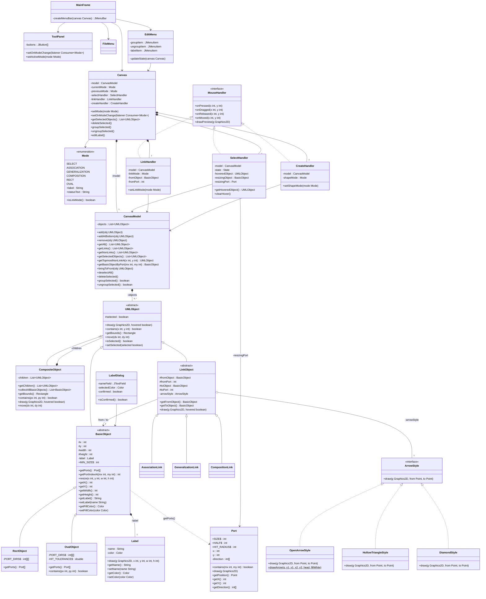

# UML Class Diagram

```mermaid
classDiagram
    %% ── model ────────────────────────────────────────────────────────────────

    class UMLObject {
        <<abstract>>
        #selected : boolean
        +draw(g Graphics2D, hovered boolean)
        +contains(x int, y int) boolean
        +getBounds() Rectangle
        +move(dx int, dy int)
        +isSelected() boolean
        +setSelected(selected boolean)
    }

    class BasicObject {
        <<abstract>>
        #x : int
        #y : int
        #width : int
        #height : int
        -label : Label
        +MIN_SIZE$ : int
        +getPorts() Port[]
        +getPortIndexAt(mx int, my int) int
        +resize(x int, y int, w int, h int)
        +getX() int
        +getY() int
        +getWidth() int
        +getHeight() int
        +getLabel() String
        +setLabel(name String)
        +getFillColor() Color
        +setFillColor(color Color)
    }

    class RectObject {
        -PORT_DIRS$ : int[][]
        +getPorts() Port[]
    }

    class OvalObject {
        -PORT_DIRS$ : int[][]
        -HIT_TOLERANCE$ : double
        +getPorts() Port[]
        +contains(px int, py int) boolean
    }

    class CompositeObject {
        -children : List~UMLObject~
        +getChildren() List~UMLObject~
        +collectAllBasicObjects() List~BasicObject~
        +getBounds() Rectangle
        +contains(px int, py int) boolean
        +draw(g Graphics2D, hovered boolean)
        +move(dx int, dy int)
    }

    class LinkObject {
        <<abstract>>
        #fromObject : BasicObject
        #fromPort : int
        #toObject : BasicObject
        #toPort : int
        -arrowStyle : ArrowStyle
        +getFromObject() BasicObject
        +getToObject() BasicObject
        +draw(g Graphics2D, hovered boolean)
    }

    class AssociationLink
    class GeneralizationLink
    class CompositionLink

    class Label {
        -name : String
        -color : Color
        +draw(g Graphics2D, x int, y int, w int, h int)
        +getName() String
        +setName(name String)
        +getColor() Color
        +setColor(color Color)
    }

    class Port {
        +SIZE$ : int
        +HALF$ : int
        +HIT_RADIUS$ : int
        -x : int
        -y : int
        -direction : int[]
        +contains(mx int, my int) boolean
        +draw(g Graphics2D)
        +getPosition() Point
        +getX() int
        +getY() int
        +getDirection() int[]
    }

    class ArrowStyle {
        <<interface>>
        +draw(g Graphics2D, from Point, to Point)
    }

    class OpenArrowStyle {
        +draw(g Graphics2D, from Point, to Point)
        +drawArrow(g, x1, y1, x2, y2, head, fillWhite)$
    }

    class HollowTriangleStyle {
        +draw(g Graphics2D, from Point, to Point)
    }

    class DiamondStyle {
        +draw(g Graphics2D, from Point, to Point)
    }

    %% ── mode ─────────────────────────────────────────────────────────────────

    class Mode {
        <<enumeration>>
        SELECT
        ASSOCIATION
        GENERALIZATION
        COMPOSITION
        RECT
        OVAL
        +label : String
        +statusText : String
        +isLinkMode() boolean
    }

    %% ── ui ───────────────────────────────────────────────────────────────────

    class Canvas {
        -model : CanvasModel
        -currentMode : Mode
        -previousMode : Mode
        -selectHandler : SelectHandler
        -linkHandler : LinkHandler
        -createHandler : CreateHandler
        +setMode(mode Mode)
        +setOnModeChange(listener Consumer~Mode~)
        +getSelectedObjects() List~UMLObject~
        +deleteSelected()
        +groupSelected()
        +ungroupSelected()
        +editLabel()
    }

    class CanvasModel {
        -objects : List~UMLObject~
        +add(obj UMLObject)
        +addAtBottom(obj UMLObject)
        +remove(obj UMLObject)
        +getAll() List~UMLObject~
        +getLinks() List~UMLObject~
        +getNonLinks() List~UMLObject~
        +getSelectedObjects() List~UMLObject~
        +getTopmostNonLinkAt(x int, y int) UMLObject
        +getBasicObjectByPort(mx int, my int) BasicObject
        +bringToFront(obj UMLObject)
        +deselectAll()
        +deleteSelected()
        +groupSelected() boolean
        +ungroupSelected() boolean
    }

    class MainFrame {
        -createMenuBar(canvas Canvas) JMenuBar
    }

    class ToolPanel {
        -buttons : JButton[]
        +setOnModeChange(listener Consumer~Mode~)
        +setActiveMode(mode Mode)
    }

    class LabelDialog {
        -nameField : JTextField
        -selectedColor : Color
        -confirmed : boolean
        +isConfirmed() boolean
    }

    class FileMenu

    class EditMenu {
        -groupItem : JMenuItem
        -ungroupItem : JMenuItem
        -labelItem : JMenuItem
        -updateState(canvas Canvas)
    }

    %% ── ui.handler ───────────────────────────────────────────────────────────

    class MouseHandler {
        <<interface>>
        +onPressed(x int, y int)
        +onDragged(x int, y int)
        +onReleased(x int, y int)
        +onMoved(x int, y int)
        +drawPreview(g Graphics2D)
    }

    class SelectHandler {
        -model : CanvasModel
        -state : State
        -hoveredObject : UMLObject
        -resizingObject : BasicObject
        -resizingPort : Port
        +getHoveredObject() UMLObject
        +clearHover()
    }

    class LinkHandler {
        -model : CanvasModel
        -linkMode : Mode
        -fromObject : BasicObject
        -fromPort : int
        +setLinkMode(mode Mode)
    }

    class CreateHandler {
        -model : CanvasModel
        -shapeMode : Mode
        +setShapeMode(mode Mode)
    }

    %% ── Inheritance ──────────────────────────────────────────────────────────

    UMLObject <|-- BasicObject
    UMLObject <|-- CompositeObject
    UMLObject <|-- LinkObject
    BasicObject <|-- RectObject
    BasicObject <|-- OvalObject
    LinkObject <|-- AssociationLink
    LinkObject <|-- GeneralizationLink
    LinkObject <|-- CompositionLink
    ArrowStyle <|.. OpenArrowStyle
    ArrowStyle <|.. HollowTriangleStyle
    ArrowStyle <|.. DiamondStyle
    MouseHandler <|.. SelectHandler
    MouseHandler <|.. LinkHandler
    MouseHandler <|.. CreateHandler

    %% ── Composition ──────────────────────────────────────────────────────────

    BasicObject *-- "1" Label : -label
    CompositeObject *-- "1..*" UMLObject : -children
    Canvas *-- "1" CanvasModel : -model
    Canvas *-- "1" SelectHandler
    Canvas *-- "1" LinkHandler
    Canvas *-- "1" CreateHandler
    CanvasModel *-- "0..*" UMLObject : -objects

    %% ── Association / Dependency ─────────────────────────────────────────────

    LinkObject o-- "1" ArrowStyle : -arrowStyle
    LinkObject --> "2" BasicObject : from / to
    BasicObject ..> Port : getPorts()

    SelectHandler --> CanvasModel
    SelectHandler --> Port : -resizingPort
    LinkHandler --> CanvasModel
    CreateHandler --> CanvasModel

    MainFrame --> Canvas
    MainFrame --> ToolPanel
    MainFrame --> FileMenu
    MainFrame --> EditMenu
    EditMenu --> Canvas
    Canvas --> Mode
    LabelDialog --> BasicObject
```
