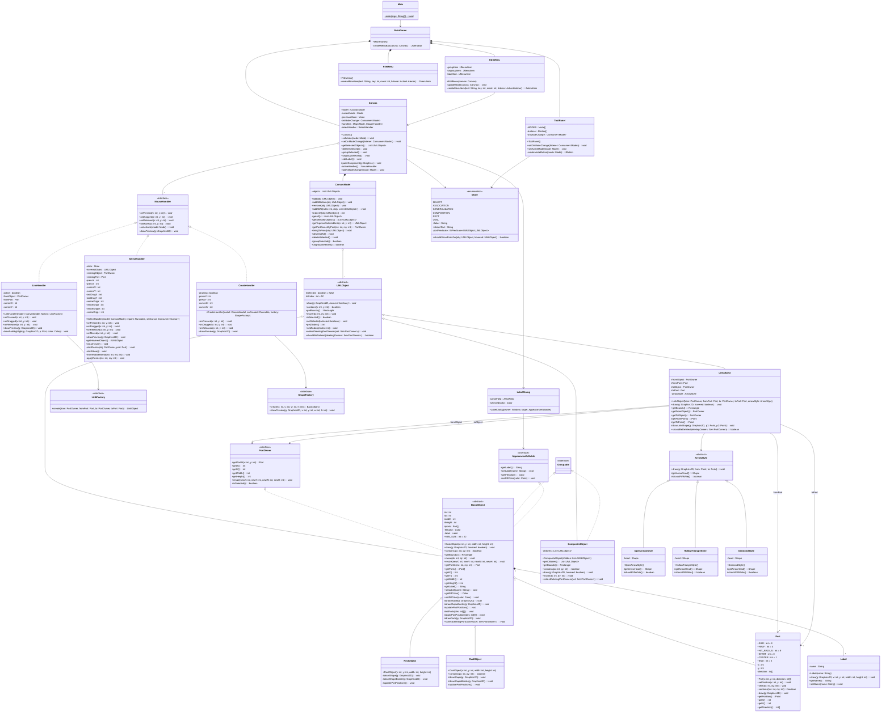

```mermaid
classDiagram
    class UMLObject {
        <<abstract>>
        #selected : boolean = false
        #zIndex : int = 50
        +draw(g: Graphics2D, hovered: boolean) : void*
        +contains(x: int, y: int) : boolean
        +getBounds() : Rectangle*
        +move(dx: int, dy: int) : void
        +isSelected() : boolean
        +setSelected(selected: boolean) : void
        +getZIndex() : int
        +setZIndex(zIndex: int) : void
        +collectDeletingPortOwners(set: Set~PortOwner~) : void
        +shouldBeDeleted(deletingOwners: Set~PortOwner~) : boolean
    }

    class PortOwner {
        <<interface>>
        +getPortAt(x: int, y: int) : Port
        +getX() : int
        +getY() : int
        +getWidth() : int
        +getHeight() : int
        +resize(newX: int, newY: int, newW: int, newH: int) : void
        +isSelected() : boolean
    }

    class Groupable {
        <<interface>>
    }

    class AppearanceEditable {
        <<interface>>
        +getLabel() : String
        +setLabel(name: String) : void
        +getFillColor() : Color
        +setFillColor(color: Color) : void
    }

    class BasicObject {
        <<abstract>>
        #x : int
        #y : int
        #width : int
        #height : int
        #ports : Port[]
        -fillColor : Color
        -label : Label
        +MIN_SIZE : int = 20
        +BasicObject(x: int, y: int, width: int, height: int)
        +draw(g: Graphics2D, hovered: boolean) : void
        +contains(px: int, py: int) : boolean
        +getBounds() : Rectangle
        +move(dx: int, dy: int) : void
        +resize(newX: int, newY: int, newW: int, newH: int) : void
        +getPortAt(mx: int, my: int) : Port
        +getPorts() : Port[]
        +getX() : int
        +getY() : int
        +getWidth() : int
        +getHeight() : int
        +getLabel() : String
        +setLabel(name: String) : void
        +getFillColor() : Color
        +setFillColor(color: Color) : void
        #drawShape(g: Graphics2D) : void*
        #drawShapeBorder(g: Graphics2D) : void*
        #updatePortPositions() : void*
        #initPorts(dirs: int[][]) : void
        #applyPortPositions(dirs: int[][]) : void
        #drawPorts(g: Graphics2D) : void
        +collectDeletingPortOwners(set: Set~PortOwner~) : void
    }

    class RectObject {
        +RectObject(x: int, y: int, width: int, height: int)
        #drawShape(g: Graphics2D) : void
        #drawShapeBorder(g: Graphics2D) : void
        #updatePortPositions() : void
    }

    class OvalObject {
        +OvalObject(x: int, y: int, width: int, height: int)
        +contains(px: int, py: int) : boolean
        #drawShape(g: Graphics2D) : void
        #drawShapeBorder(g: Graphics2D) : void
        #updatePortPositions() : void
    }

    class CompositeObject {
        -children : List~UMLObject~
        +CompositeObject(children: List~UMLObject~)
        +getChildren() : List~UMLObject~
        +getBounds() : Rectangle
        +contains(px: int, py: int) : boolean
        +draw(g: Graphics2D, hovered: boolean) : void
        +move(dx: int, dy: int) : void
        +collectDeletingPortOwners(set: Set~PortOwner~) : void
    }

    class LinkObject {
        #fromObject : PortOwner
        #fromPort : Port
        #toObject : PortOwner
        #toPort : Port
        -arrowStyle : ArrowStyle
        +LinkObject(from: PortOwner, fromPort: Port, to: PortOwner, toPort: Port, arrowStyle: ArrowStyle)
        +draw(g: Graphics2D, hovered: boolean) : void
        +getBounds() : Rectangle
        +getFromObject() : PortOwner
        +getToObject() : PortOwner
        #getFromPoint() : Point
        #getToPoint() : Point
        #drawLinkShape(g: Graphics2D, p1: Point, p2: Point) : void
        +shouldBeDeleted(deletingOwners: Set~PortOwner~) : boolean
    }

    class Port {
        +SIZE : int = 8
        +HALF : int = 4
        +HIT_RADIUS : int = 9
        +START : int = 0
        +CENTER : int = 1
        +END : int = 2
        -x : int
        -y : int
        -direction : int[]
        +Port(x: int, y: int, direction: int[])
        +setPosition(x: int, y: int) : void
        +shift(dx: int, dy: int) : void
        +contains(mx: int, my: int) : boolean
        +draw(g: Graphics2D) : void
        +getPosition() : Point
        +getX() : int
        +getY() : int
        +getDirection() : int[]
    }

    class Label {
        -name : String
        +Label(name: String)
        +draw(g: Graphics2D, x: int, y: int, width: int, height: int) : void
        +getName() : String
        +setName(name: String) : void
    }

    class ArrowStyle {
        <<abstract>>
        +draw(g: Graphics2D, from: Point, to: Point) : void
        #getArrowHead() : Shape*
        #shouldFillWhite() : boolean*
    }

    class OpenArrowStyle {
        -head : Shape
        +OpenArrowStyle()
        #getArrowHead() : Shape
        #shouldFillWhite() : boolean
    }

    class HollowTriangleStyle {
        -head : Shape
        +HollowTriangleStyle()
        #getArrowHead() : Shape
        #shouldFillWhite() : boolean
    }

    class DiamondStyle {
        -head : Shape
        +DiamondStyle()
        #getArrowHead() : Shape
        #shouldFillWhite() : boolean
    }

    class MouseHandler {
        <<interface>>
        +onPressed(x: int, y: int) : void*
        +onDragged(x: int, y: int) : void*
        +onReleased(x: int, y: int) : void*
        +onMoved(x: int, y: int) : void
        +onActivate(mode: Mode) : void
        +drawPreview(g: Graphics2D) : void*
    }

    class SelectHandler {
        -state : State
        -hoveredObject : UMLObject
        -resizingObject : PortOwner
        -resizingPort : Port
        -pressX : int
        -pressY : int
        -currentX : int
        -currentY : int
        -lastDragX : int
        -lastDragY : int
        -resizeOrigX : int
        -resizeOrigY : int
        -resizeOrigW : int
        -resizeOrigH : int
        +SelectHandler(model: CanvasModel, repaint: Runnable, setCursor: Consumer~Cursor~)
        +onPressed(x: int, y: int) : void
        +onDragged(x: int, y: int) : void
        +onReleased(x: int, y: int) : void
        +onMoved(x: int, y: int) : void
        +drawPreview(g: Graphics2D) : void
        +getHoveredObject() : UMLObject
        +clearHover() : void
        -startResize(obj: PortOwner, port: Port) : void
        -startMove() : void
        -finishRubberBand(mx: int, my: int) : void
        -applyResize(mx: int, my: int) : void
    }

    class LinkHandler {
        -active : boolean
        -fromObject : PortOwner
        -fromPort : Port
        -currentX : int
        -currentY : int
        +LinkHandler(model: CanvasModel, factory: LinkFactory)
        +onPressed(x: int, y: int) : void
        +onDragged(x: int, y: int) : void
        +onReleased(x: int, y: int) : void
        +drawPreview(g: Graphics2D) : void
        -drawPortHighlight(g: Graphics2D, p: Port, color: Color) : void
    }

    class LinkFactory {
        <<interface>>
        +create(from: PortOwner, fromPort: Port, to: PortOwner, toPort: Port) : LinkObject
    }

    class CreateHandler {
        -drawing : boolean
        -pressX : int
        -pressY : int
        -currentX : int
        -currentY : int
        +CreateHandler(model: CanvasModel, onCreated: Runnable, factory: ShapeFactory)
        +onPressed(x: int, y: int) : void
        +onDragged(x: int, y: int) : void
        +onReleased(x: int, y: int) : void
        +drawPreview(g: Graphics2D) : void
    }

    class ShapeFactory {
        <<interface>>
        +create(x: int, y: int, w: int, h: int) : BasicObject
        +drawPreview(g: Graphics2D, x: int, y: int, w: int, h: int) : void
    }

    class CanvasModel {
        -objects : List~UMLObject~
        +add(obj: UMLObject) : void
        +addAtBottom(obj: UMLObject) : void
        +remove(obj: UMLObject) : void
        +addAllAt(index: int, objs: List~UMLObject~) : void
        +indexOf(obj: UMLObject) : int
        +getAll() : List~UMLObject~
        +getSelectedObjects() : List~UMLObject~
        +getTopmostSelectableAt(x: int, y: int) : UMLObject
        +getPortOwnerByPort(mx: int, my: int) : PortOwner
        +bringToFront(obj: UMLObject) : void
        +deselectAll() : void
        +deleteSelected() : void
        +groupSelected() : boolean
        +ungroupSelected() : boolean
    }

    class Canvas {
        -model : CanvasModel
        -currentMode : Mode
        -previousMode : Mode
        -onModeChange : Consumer~Mode~
        -handlers : Map~Mode, MouseHandler~
        -selectHandler : SelectHandler
        +Canvas()
        +setMode(mode: Mode) : void
        +setOnModeChange(listener: Consumer~Mode~) : void
        +getSelectedObjects() : List~UMLObject~
        +deleteSelected() : void
        +groupSelected() : void
        +ungroupSelected() : void
        +editLabel() : void
        #paintComponent(g: Graphics) : void
        -activeHandler() : MouseHandler
        -notifyModeChange(mode: Mode) : void
    }

    class Mode {
        <<enumeration>>
        SELECT
        ASSOCIATION
        GENERALIZATION
        COMPOSITION
        RECT
        OVAL
        +label : String
        +statusText : String
        -portPredicate : BiPredicate~UMLObject,UMLObject~
        +shouldShowPortsFor(obj: UMLObject, hovered: UMLObject) : boolean
    }

    class Main {
        +main(args: String[]) : void$
    }

    class MainFrame {
        +MainFrame()
        -createMenuBar(canvas: Canvas) : JMenuBar
    }

    class ToolPanel {
        -MODES : Mode[]
        -buttons : JButton[]
        -onModeChange : Consumer~Mode~
        +ToolPanel()
        +setOnModeChange(listener: Consumer~Mode~) : void
        +setActiveMode(mode: Mode) : void
        -createModeButton(mode: Mode) : JButton
    }

    class EditMenu {
        -groupItem : JMenuItem
        -ungroupItem : JMenuItem
        -labelItem : JMenuItem
        +EditMenu(canvas: Canvas)
        -updateState(canvas: Canvas) : void
        -createMenuItem(text: String, key: int, mask: int, listener: ActionListener) : JMenuItem
    }

    class FileMenu {
        +FileMenu()
        -createMenuItem(text: String, key: int, mask: int, listener: ActionListener) : JMenuItem
    }

    class LabelDialog {
        -nameField : JTextField
        -selectedColor : Color
        +LabelDialog(owner: Window, target: AppearanceEditable)
    }

    UMLObject <|-- BasicObject
    UMLObject <|-- CompositeObject
    UMLObject <|-- LinkObject
    PortOwner <|.. BasicObject
    BasicObject <|-- RectObject
    BasicObject <|-- OvalObject
    Groupable <|.. BasicObject
    Groupable <|.. CompositeObject
    AppearanceEditable <|.. BasicObject
    ArrowStyle <|-- OpenArrowStyle
    ArrowStyle <|-- HollowTriangleStyle
    ArrowStyle <|-- DiamondStyle
    MouseHandler <|.. SelectHandler
    MouseHandler <|.. LinkHandler
    MouseHandler <|.. CreateHandler
    BasicObject "1" o-- "*" Port
    BasicObject "1" *-- "1" Label
    LinkObject --> "1" Port : fromPort
    LinkObject --> "1" Port : toPort
    LinkObject --> "1" PortOwner : fromObject
    LinkObject --> "1" PortOwner : toObject
    LinkObject --> ArrowStyle
    LinkHandler --> LinkFactory
    CreateHandler --> ShapeFactory
    CanvasModel o-- "*" UMLObject
    Canvas *-- CanvasModel
    Canvas o-- "*" MouseHandler
    Canvas --> Mode
    Main --> MainFrame
    MainFrame *-- Canvas
    MainFrame *-- ToolPanel
    MainFrame *-- FileMenu
    MainFrame *-- EditMenu
    EditMenu --> Canvas
    ToolPanel --> Mode
    Canvas --> LabelDialog
    LabelDialog --> AppearanceEditable
```
