# UML Editor — Use Case 時序圖

## Use Case A：建立形狀物件（Rect / Oval）

使用者從工具列選取 RECT 或 OVAL 模式，然後在畫布上拖曳來定義邊界框。

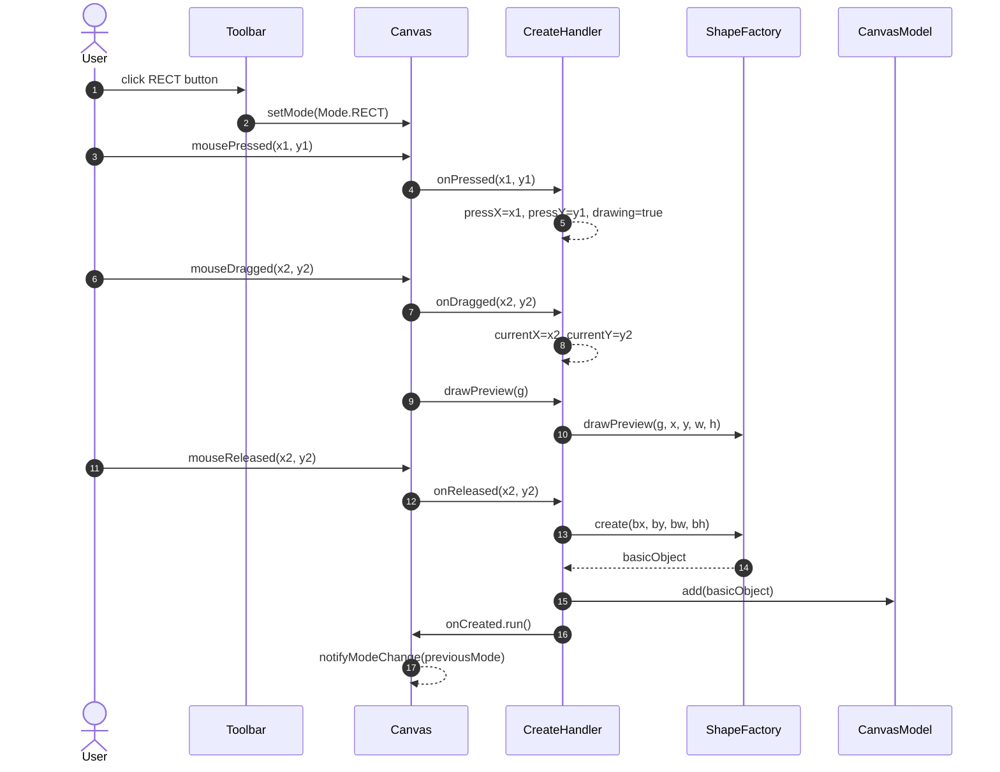

---

## Use Case B：建立連結（Association / Generalization / Composition）

### B（主流程）：成功建立連結

使用者選取連結模式，從一個形狀的 port 拖曳至另一個形狀的 port，成功建立連結。

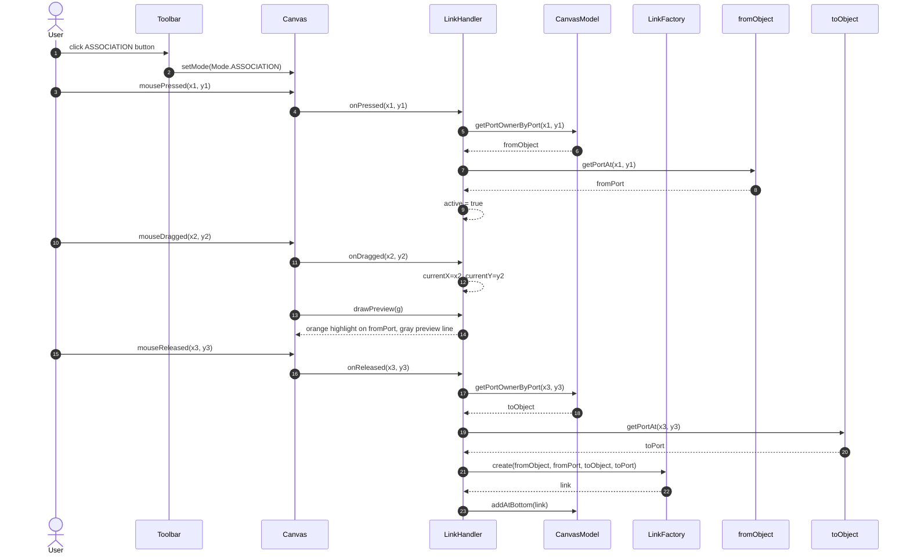

### B.1：起點不在任何 port 上 → 取消

使用者在空白處或形狀本體（而非 port 附近）按下滑鼠，`getPortOwnerByPort` 回傳 null，立即結束，不進入拖曳流程。

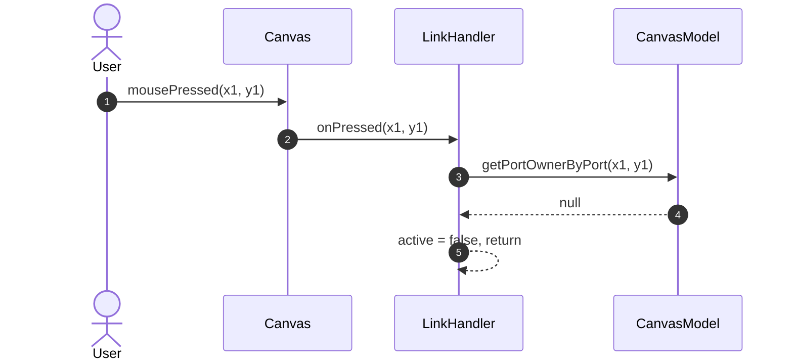

### B.2：放開時目標無效 → 取消

使用者放開滑鼠時，終點不在合法 port 上（目標物件為 null、與起點相同、或找不到 port），不建立連結。

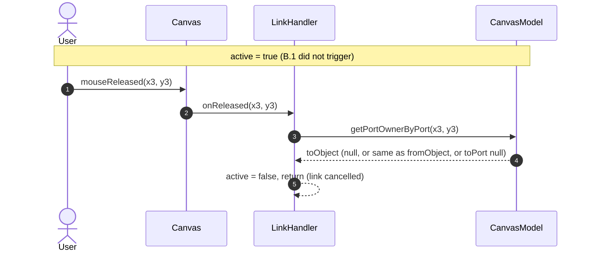

---

## Use Case C：選取 / 取消選取物件

### C1：點擊選取單一物件

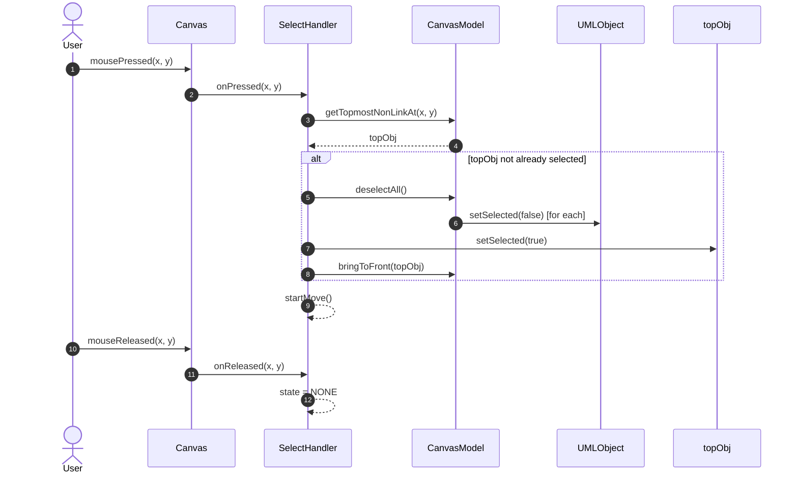

### C2：點擊空白區域取消所有選取

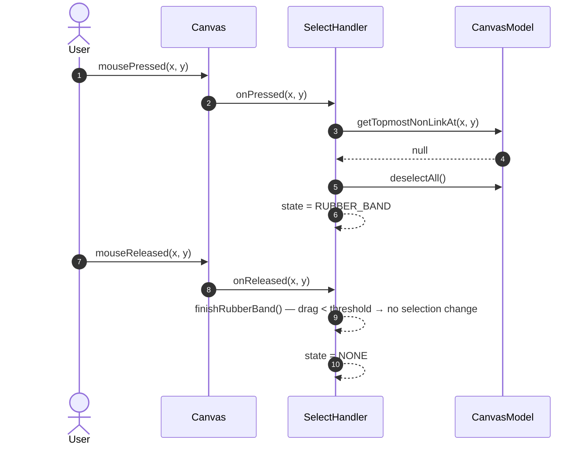

### C3：橡皮筋框選多個物件

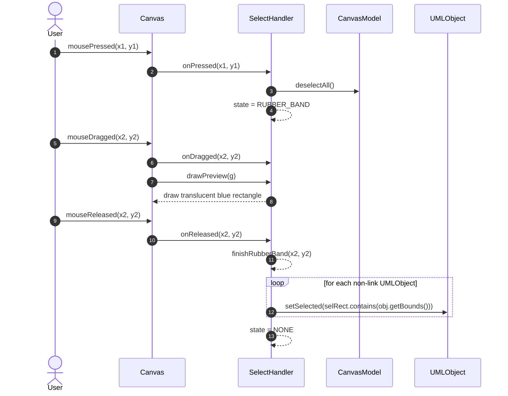

---

## Use Case D：群組 / 解散群組

### D1：將選取物件群組化

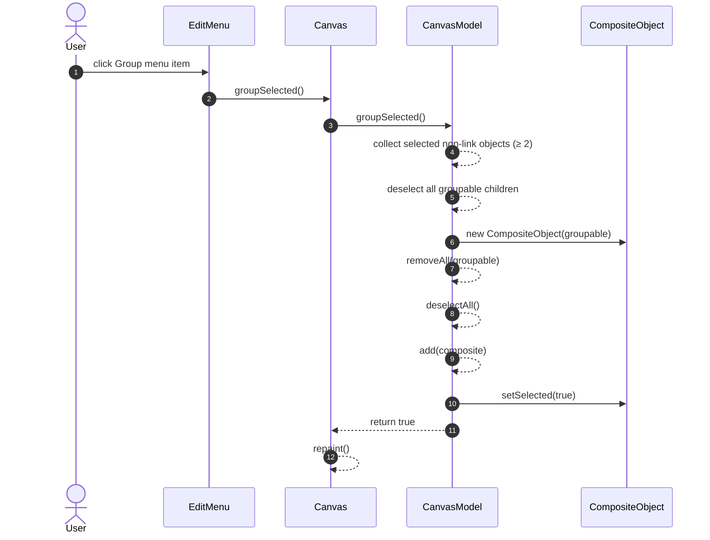

### D2：解散選取的群組

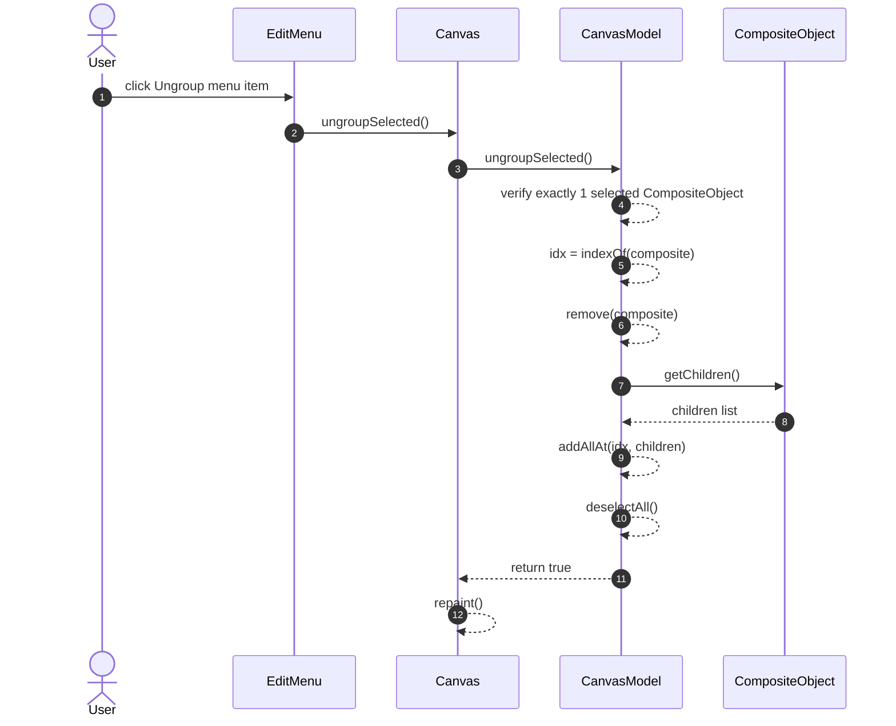

---

## Use Case E：移動物件

### E1：移動單一選取物件

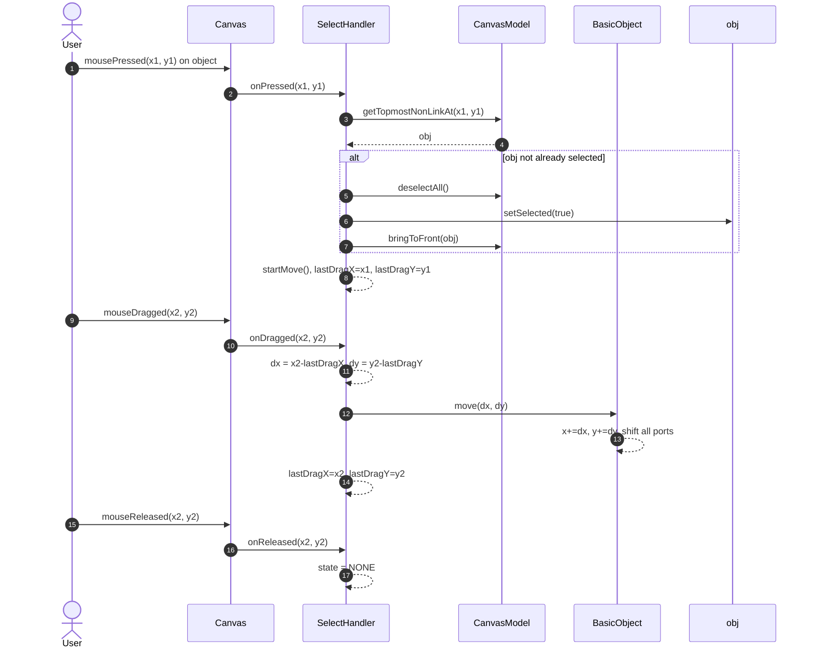

### E2：同時移動多個選取物件

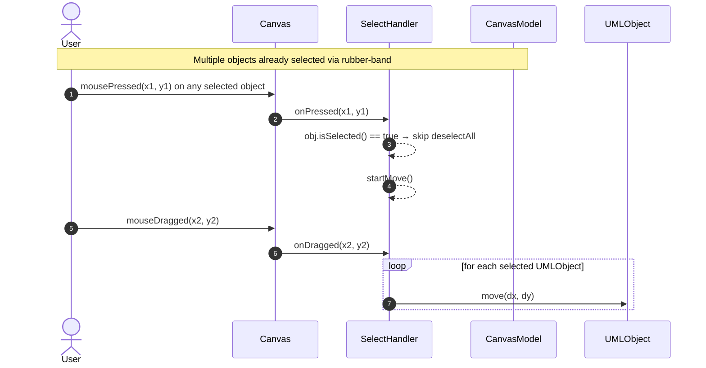

---

## Use Case F：縮放物件

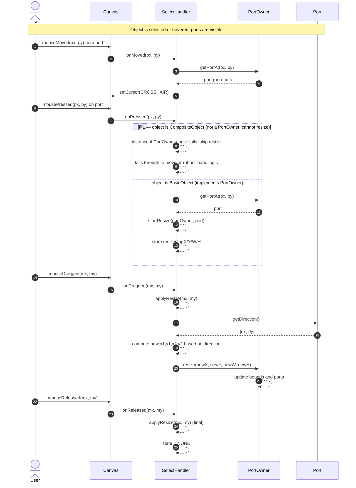

---

## Use Case G：自訂標籤與樣式（編輯名稱與顏色）

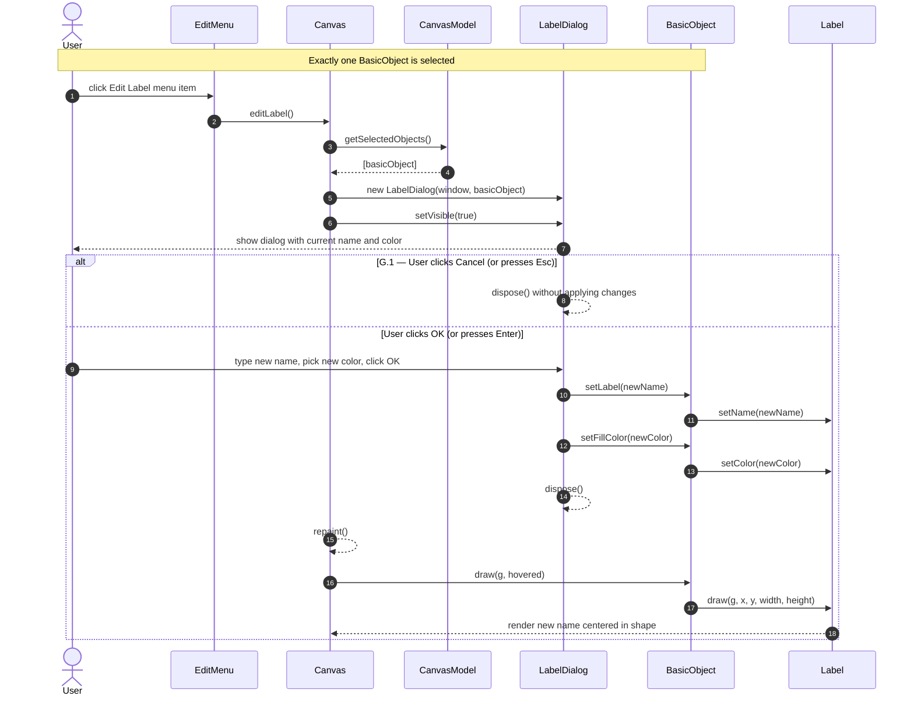
