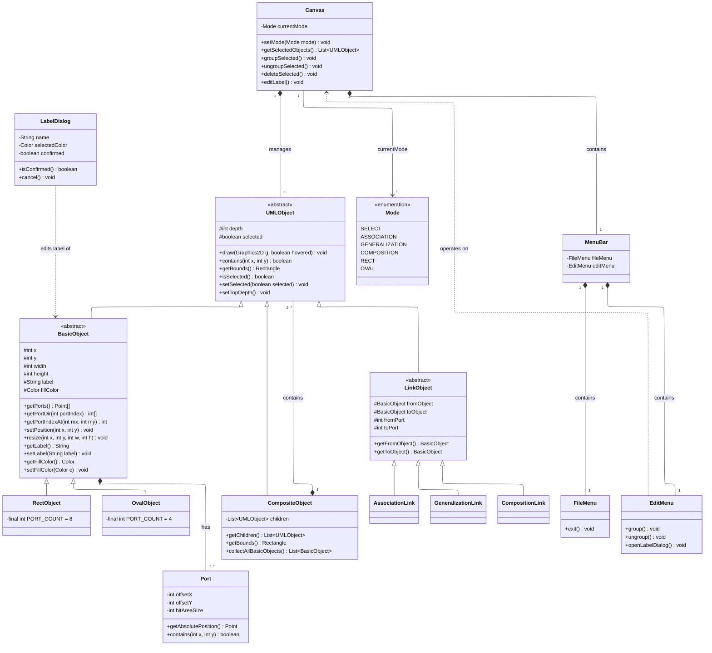

```mermaid
---
config:
  layout: elk
---
classDiagram
    UMLObject <|-- BasicObject
    UMLObject <|-- CompositeObject
    UMLObject <|-- LinkObject
    BasicObject <|-- RectObject
    BasicObject <|-- OvalObject
    LinkObject <|-- AssociationLink
    LinkObject <|-- GeneralizationLink
    LinkObject <|-- CompositionLink

    class UMLObject {
        <<abstract>>
        #int depth
        #boolean selected
        +draw(Graphics2D g, boolean hovered) void
        +contains(int x, int y) boolean
        +getBounds() Rectangle
        +isSelected() boolean
        +setSelected(boolean selected) void
        +setTopDepth() void
    }

    class BasicObject {
        <<abstract>>
        #int x
        #int y
        #int width
        #int height
        #String label
        #Color fillColor
        +getPorts() Point[]
        +getPortDir(int portIndex) int[]
        +getPortIndexAt(int mx, int my) int
        +setPosition(int x, int y) void
        +resize(int x, int y, int w, int h) void
        +getLabel() String
        +setLabel(String label) void
        +getFillColor() Color
        +setFillColor(Color c) void
    }

    class RectObject {
        -final int PORT_COUNT = 8
    }

    class OvalObject {
        -final int PORT_COUNT = 4
    }

    class CompositeObject {
        -List~UMLObject~ children
        +getChildren() List~UMLObject~
        +getBounds() Rectangle
        +collectAllBasicObjects() List~BasicObject~
    }

    class Port {
        -int offsetX
        -int offsetY
        -int hitAreaSize
        +getAbsolutePosition() Point
        +contains(int x, int y) boolean
    }

    class LinkObject {
        <<abstract>>
        #BasicObject fromObject
        #BasicObject toObject
        #int fromPort
        #int toPort
        +getFromObject() BasicObject
        +getToObject() BasicObject
    }

    class AssociationLink
    class GeneralizationLink
    class CompositionLink

    class Canvas {
        -Mode currentMode
        +setMode(Mode mode) void
        +getSelectedObjects() List~UMLObject~
        +groupSelected() void
        +ungroupSelected() void
        +deleteSelected() void
        +editLabel() void
    }

    class Mode {
        <<enumeration>>
        SELECT
        ASSOCIATION
        GENERALIZATION
        COMPOSITION
        RECT
        OVAL
    }

    class MenuBar {
        -FileMenu fileMenu
        -EditMenu editMenu
    }

    class FileMenu {
        +exit() void
    }

    class EditMenu {
        +group() void
        +ungroup() void
        +openLabelDialog() void
    }

    class LabelDialog {
        -String name
        -Color selectedColor
        -boolean confirmed
        +isConfirmed() boolean
        +cancel() void
    }

    Canvas "1" *-- "n" UMLObject : manages
    Canvas "1" --> "1" Mode : currentMode
    Canvas "1" *-- "1" MenuBar : contains
    BasicObject "1" *-- "1..*" Port : has
    CompositeObject "1" *-- "2..*" UMLObject : contains
    MenuBar "1" *-- "1" FileMenu : contains
    MenuBar "1" *-- "1" EditMenu : contains
    EditMenu ..> Canvas : operates on
    LabelDialog ..> BasicObject : edits label of
```